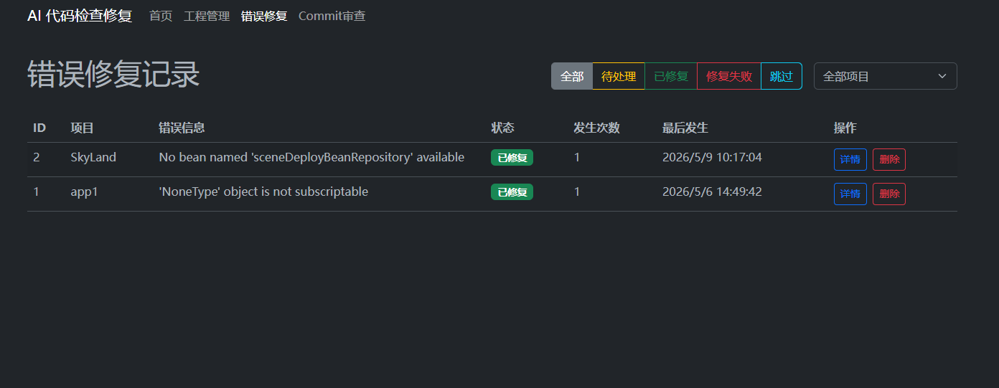
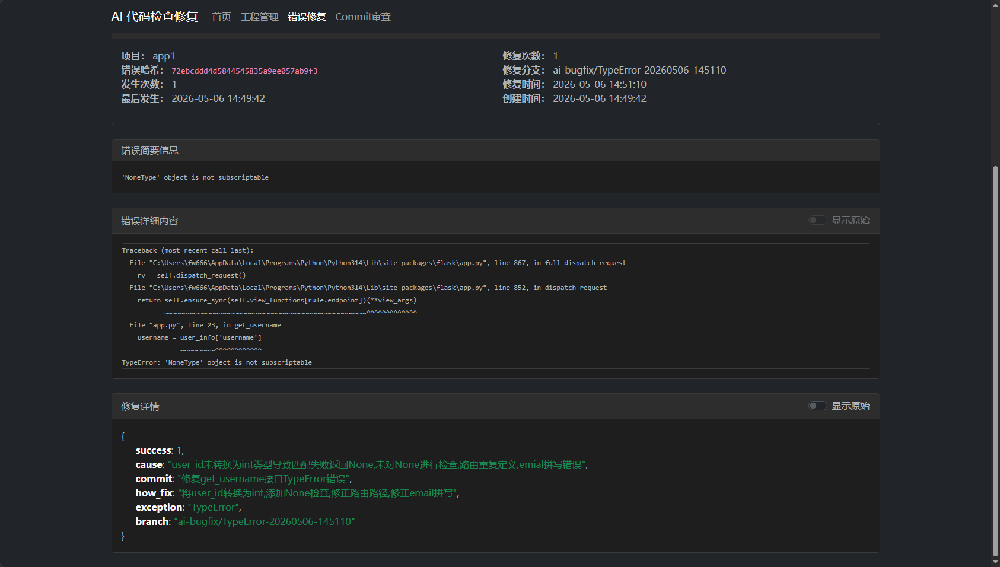
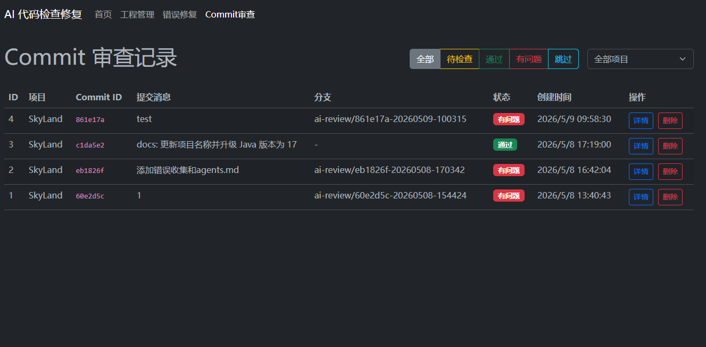
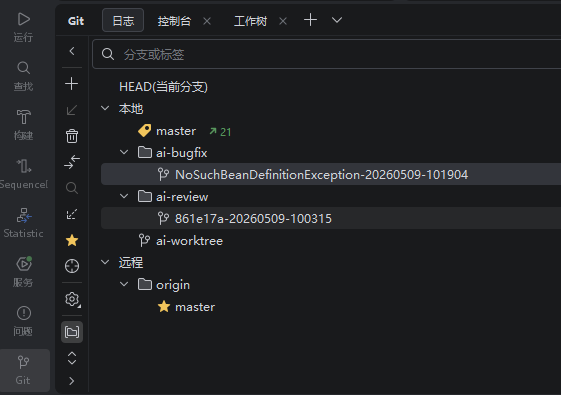
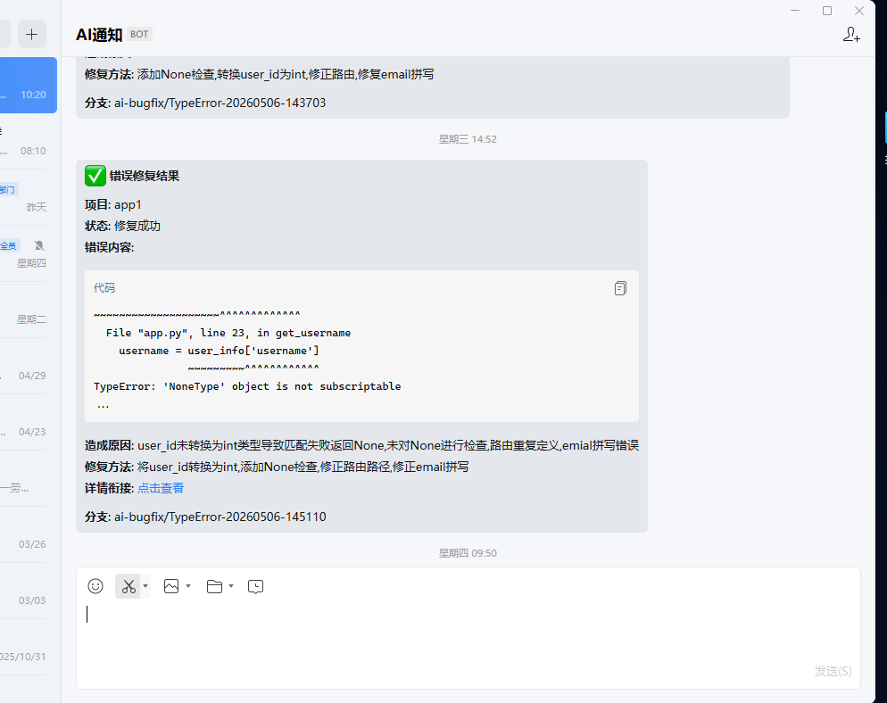

# AI Auto Fix —— 让 Claude Code Agent 成为你的 24 小时自动化代码审查与修复助手

> 还在手动排查线上错误、逐行 Review 代码？**AI Auto Fix** 是一套基于 Flask 的自动化系统，它接收错误日志和 Git Commit 信息，调度 Claude Code Agent 在隔离 worktree 中自动完成代码修复与审查，并通过企业微信实时推送结果。开发团队只需关注业务，把重复劳动交给 AI。

---

## 一、它能做什么？

### 1. 错误自动修复：从报错到 PR，全程无人值守

当你的应用抛出异常，只需把错误日志推送到 AI Auto Fix，系统会自动：

1. 校验项目并入库（状态 `pending`）
2. 调度器在独立 worktree 中拉取最新代码
3. 调用 Claude Code Agent 分析堆栈、定位根因、编写修复
4. 创建并推送 `ai-bugfix/<error_id>` 分支
5. 更新状态并推送企业微信通知



*错误修复列表页：一目了然地查看所有项目错误的状态——待处理、已修复、修复失败、跳过，支持按项目筛选。*



*错误修复详情页：完整展示错误堆栈、发生次数、修复分支与时间；底部呈现 AI 的修复摘要——根因、修复方法、目标分支，做到每一次修复都有据可查。*

### 2. Commit 自动审查：提交即审查，问题早发现

通过在项目仓库中注册 `post-commit` hook，每次commit代码后，系统会自动：

1. 接收 Commit 信息并入库
2. 获取该 Commit 的 diff
3. Agent 审查代码规范、潜在 Bug、安全漏洞
4. 发现问题后创建 `ai-review/<commit_id>` 分支推送修复



*Commit 审查记录：清晰展示每条 Commit 的审查结果——通过、有问题、跳过。发现问题后，系统会自动创建 `ai-review/xxx` 分支供团队复核。*



*Git 分支视图：AI 自动创建的分支结构清晰——`ai-bugfix/*` 用于错误修复，`ai-review/*` 用于代码审查修复，`ai-worktree` 作为基准分支隔离用户代码，绝不污染主分支。*

### 3. 实时企业微信通知，修复结果秒级触达

无需盯着后台，AI 处理完成后会第一时间通过企业微信机器人推送结果，附带管理后台链接，随时随地掌握修复进度。



*企业微信通知示例：包含项目名、修复状态、错误类型、造成原因、修复方法以及直达详情的链接，让团队协作无缝衔接。*

---

## 二、技术架构一览

```
外部项目/Hook          AI Auto Fix 服务端              Claude Code Agent
    |                        |                              |
    |-- POST /api/push/error-|                              |
    |-- GET /api/push/commit-|                              |
    |                        |-- scheduler 轮询             |
    |                        |-- ai_bugfix / ai_review     |
    |                        |                              |
    |                        |-----------------------------|
    |                        |  Agent 在独立 worktree 中修复 |
    |                        |-----------------------------|
    |                        |-- 创建 ai-*/xxx 分支推送     |
    |                        |-- 更新数据库 + 企业微信通知    |
```

| 模块 | 技术选型 | 说明 |
|------|----------|------|
| Web 框架 | Flask 2.x | 轻量高效，快速接入 |
| 数据库 | SQLAlchemy 2.x + SQLite | 零配置，开箱即用 |
| AI 引擎 | Claude Code Agent CLI | 在隔离 worktree 中安全执行 |
| 通知 | 企业微信机器人 | 实时推送处理结果 |
| 前端 | Jinja2 模板 + 原生 JS | 管理后台简洁直观 |
| 测试 | pytest | 全链路单元测试覆盖 |

---

## 三、核心亮点

- **完全隔离**：AI 所有操作都在独立 worktree 中进行，使用专用 `ai-*` 分支，绝不直接修改主分支，安全可控。
- **零侵入接入**：外部项目仅需一个 HTTP 调用推送错误，或通过 post-commit hook 自动触发，无需改造现有架构。
- **Web 管理后台**：提供统计概览、错误/Commit 列表与详情、项目管理，所有数据可视化呈现。
- **可扩展提示词**：Agent 的修复与审查逻辑统一收口在 `src/prompts.py`，随时可按团队规范调整。
- **一键清理**：支持删除错误/Commit 记录并同步清理关联的 AI 分支，避免仓库臃肿。

---

## 四、快速开始

```bash
# 1. 克隆并安装依赖
git clone <your-repo>
cd ai-auto-fix
pip install -r requirements.txt

# 2. 配置企业微信机器人（可选，也可直接改 src/config.py）
cp .env.example .env
# 编辑 NOTIFIER_BOT_ID, NOTIFIER_SECRET, NOTIFIER_USER_ID

# 3. 启动服务
python app.py
# 服务默认运行在 http://0.0.0.0:3002
```

推送一条错误测试：//真实场景在程序中监听错误或监听错误日志推送, 相关语言监听文件示例在/data/error_report_util中

```bash
curl -X POST http://localhost:3002/api/push/error \
  -H "Content-Type: application/json" \
  -d '{"project_name":"my-project","error_content":"Traceback ..."}'
```

然后打开 `http://localhost:3002/admin/errors` 即可看到 AI 自动修复的全过程。

---

## 五、适用场景

| 场景 | 价值 |
|------|------|
| **线上故障应急** | 错误日志自动触发修复，缩短 MTTR |
| **代码质量门禁** | Commit 自动审查，把问题拦截在合并前 |
| **多项目统一治理** | 一个平台管理多个项目的 AI 修复与审查 |
| **团队知识沉淀** | 每次修复的“根因+方案”自动归档，形成可检索的知识库 |

---

## 六、结语

AI Auto Fix 不是替代开发者，而是把**重复、机械、低价值**的排查与修补工作自动化，让人类工程师把时间花在真正需要创造力的设计上。如果你也正在寻找一种方式，把 Claude Code 的能力无缝接入团队日常开发流程，不妨试试 AI Auto Fix。

> GitHub: [your-repo-url]  
> 技术栈：Python · Flask · SQLAlchemy · Claude Code · 企业微信  
> License: MIT
